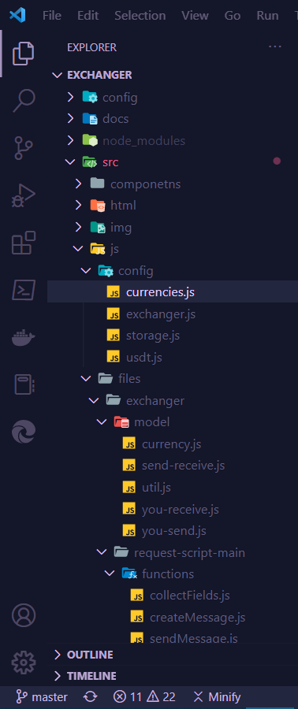

# Project configuration

The Webpack and Gulp configuration files, such as [`gulp-settings.js`](../config/gulp-settings.js) or [`webpack.prod.js`](../config/webpack.prod.js) are placed in `config/` folder.

You might change those if you need to alter the project configuration, but those will not affect the application logic.

The application configuration files are placed in `src/js/config/` folder:

- [`currencies.js`](../src/js/config/currencies.js) defines `currencyFactors` to control crypto price for each cryptocurrency.

    To obtain cryptocurrency identifier (the `id` property), proceed to [`fetch-currencies.js`](../src/js/files/fetch-currencies.js) file.

    You might also want to read [Binance API V3 (Spot) Documentation](https://binance-docs.github.io/apidocs/spot/en).

- [`exchanger.js`](../src/js/config/exchanger.js) contains a data for **Exchanger** page logic, including data to connect to Telegram.

- [`storage.js`](../src/js/config/storage.js) contains a token names for `localStorage`, where to store cryptocurrency id between redirect from **Home** page to **Exchanger** page. As a result, cryptocurrency is selected at **Exchanger**.

