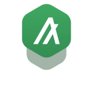
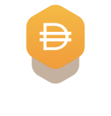
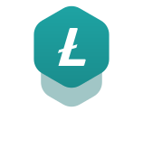
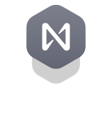
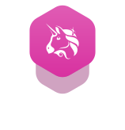

# fonticons SCSS reference

Import `fonticons` SCSS using:

```SCSS
@import "fonticons";
```

**Important!** Import `fonticons` before your SCSS, so your styles are applied last.

## sub-icons

|Icon|CSS class|
|----|---------|
||`.fonticons-sub-bitcoin`|
||`.fonticons-sub-fingerprint`|
||`.fonticons-sub-shield`|

## icons-cryptocurrency

|Icon|Cryptocurrency name|CSS class|
|----|-------------------|---------|
||Cardano|`.fonticons-ada`|
||Algorand|`.fonticons-algo`|
||ApeCoin|`.fonticons-ape`|
||Avalanche|`.fonticons-avax`|
||Bitcoin Cash|`.fonticons-bch`|
||Binance coin|`.fonticons-bnb`|
||Bitcoin|`.fonticons-btc`|
||Binance USD|`.fonticons-busd`|
||Cronos|`.fonticons-cro`|
||Dai|`.fonticons-dai`|
||Dogecoin|`.fonticons-doge`|
||Polkadot|`.fonticons-dot`|
||MultiversX (Elrond)|`.fonticons-egld`|
||Ethereum|`.fonticons-eth`|
||Ethereum Classic|`.fonticons-etc`|
||Flow|`.fonticons-flow`|
||FTX Token|`.fonticons-ftt`|
||Hedera|`.fonticons-hbar`|
||Internet Computer|`.fonticons-icp`|
||KuCoin Token|`.fonticons-kcs`|
||UNUS SED LEO|`.fonticons-leo`|
||Chainlink|`.fonticons-link`|
||Litecoin|`.fonticons-ltc`|
||Decentraland|`.fonticons-mana`|
||Polygon|`.fonticons-matic`|
||NEAR Protocol|`.fonticons-near`|
||The sandbox|`.fonticons-sand`|
||Shiba Inu|`.fonticons-shib`|
||Solana|`.fonticons-sol`|
||TRON|`.fonticons-trx`|
||Uniswap|`.fonticons-uni`|
||USD Coin|`.fonticons-usdc`|
||Tether|`.fonticons-usdt`|
||VeChain|`.fonticons-vet`|
||Wrapped Bitcoin|`.fonticons-wbtc`|
||Stellar|`.fonticons-xlm`|
||Monero|`.fonticons-xmr`|
||Ripple|`.fonticons-xrp`|
||Tezos|`.fonticons-xtz`|
